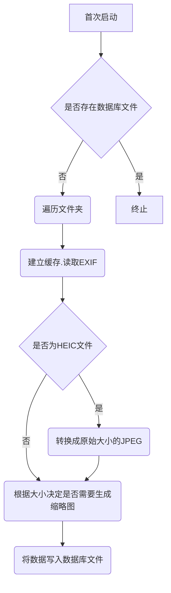
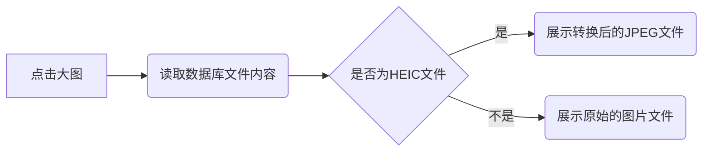

## 项目概述

本项目旨在开发一个基于Python的后端服务，用于处理和浏览已有成型的文件夹结构中的图片。项目采用前后端分离的架构，后端负责图片的处理、存储和提供相关数据接口。

## 技术栈

- **编程语言**: Python
- **数据库**: SQLite
- **图片处理库**: Pillow, pyheif（用于HEIC文件转换）
- **Web框架**: FastAPI（推荐）
- **其他工具**: SQLAlchemy（数据库交互）、ExifRead（读取EXIF信息）

## 支持的图片格式

后端服务支持以下主流图片格式（扩展名不区分大小写）：

- `.jpg`
- `.jpeg`
- `.png`
- `.gif`
- `.webp`
- `.heic`
- `.heif`

## 功能列表

1. **文件目录结构读取**
    - 遍历指定的图片文件夹，读取其目录结构和图片文件。
  
2. **数据库交互**
    - 使用SQLite数据库存储图片信息，包括文件路径、EXIF数据、缩略图路径等。
  
3. **缩略图生成**
    - 根据图片大小和配置生成缩略图，以优化前端展示性能。
  
4. **EXIF信息读取**
    - 读取并存储图片的EXIF元数据，供前端展示使用。
  
5. **HEIC文件处理**
    - 支持HEIC和HEIF格式的图片，自动转换为JPEG格式以便展示。
  
6. **缓存机制**
    - 建立缓存机制，减少重复计算和文件读取，提高性能。

## 基本流程

### 首次启动流程

打开文件夹流程

打开大图流程

## 数据库设计

### 表结构

- **folders**
    - `id` (INTEGER, PRIMARY KEY)
    - `folder_path` (TEXT, UNIQUE)  # 相对路径
    - `name` (TEXT)  # 文件夹名称
    - `parent_id` (INTEGER, FOREIGN KEY)  # 父文件夹ID，根目录为0
    - `created_at` (TIMESTAMP)
    - `updated_at` (TIMESTAMP)

- **images**
    - `id` (INTEGER, PRIMARY KEY)
    - `file_path` (TEXT, UNIQUE)
    - `folder_id` (INTEGER, FOREIGN KEY)  # 所属文件夹ID
    - `name` (TEXT)  # 文件名
    - `thumbnail_path` (TEXT)
    - `exif_data` (JSON)
    - `is_heic` (BOOLEAN)
    - `converted_path` (TEXT, 可选)
    - `image_type` (TEXT)  # original, converted, thumbnail
    - `parent_id` (INTEGER, FOREIGN KEY)  # 原图ID，用于关联转换图和缩略图
    - `is_thumbnail` (BOOLEAN)  # 是否作为缩略图使用
    - `created_at` (TIMESTAMP)
    - `updated_at` (TIMESTAMP)

### 文件夹结构

- 根目录 (id = 0) 代表图片库的入口点
- 所有文件夹通过 parent_id 形成树状结构
- API 默认从根目录开始查询

## API 设计

### 1. 获取文件夹列表

- **Endpoint**: `/api/folders`
- **Method**: `GET`
- **Description**: 返回所有文件夹的列表及其相关信息。

### 2. 获取指定文件夹的图片

- **Endpoint**: `/api/folders/{folder_id}/images`
- **Method**: `GET`
- **Description**: 返回指定文件夹中所有图片的缩略图及基本信息。

### 3. 获取大图

- **Endpoint**: `/api/images/{image_id}`
- **Method**: `GET`
- **Description**: 根据图片ID返回原始图片或转换后的JPEG文件。

### 4. 更新数据库

- **Endpoint**: `/api/update`
- **Method**: `POST`
- **Description**: 触发后台更新数据库的操作，包括：
    - 全盘重新扫描
    - 实时文件夹监控的初始化

## 前端需求

- **框架**: 配合后端使用，采用Tailwind CSS。
- **设计要求**:
    - 简洁易用
    - 响应式设计，便于移动端使用
    - 支持中英文切换
- **功能集成**:
    - 展示文件夹列表
    - 显示缩略图
    - 支持点击缩略图查看大图

## 错误处理

- **404 Not Found**: 图片或文件夹不存在。
- **500 Internal Server Error**: 服务器内部错误，如数据库连接失败、文件读取错误等。
- **400 Bad Request**: 请求参数错误。

## 性能优化

- **异步处理**: 使用异步IO处理文件读取和图片处理任务，提升响应速度。
- **批量操作**: 批量读取和写入数据库，减少数据库交互次数。
- **缓存机制**: 利用内存缓存或文件缓存，加快重复请求的响应速度。

## 安全考虑

- **输入验证**: 对所有API输入进行严格验证，防止注入攻击。
- **权限控制**: 不需要用户认证和权限管理，因为是私有项目。
- **数据备份**: 定期备份SQLite数据库，防止数据丢失。

## 部署方案

- **服务器要求**: 支持Python运行环境，推荐使用Linux服务器。
- **依赖管理**: 使用`requirements.txt`管理Python依赖包。
- **容器化**: 最终通过Docker容器进行部署（详细方案待后续讨论）。
- **监控和日志**: 集成日志记录和监控工具，实时监控服务运行状态。

## 多语言支持

- **支持语言**: 中文和英文。
- **实现方式**: 后端提供多语言接口，前端根据用户选择切换语言。

## 缩略图生成策略

- **尺寸**: 固定大小（例如 200x200 像素）。
- **比例**: 保持原图的宽高比例，避免图片变形。

## 图片更新机制

- **全盘重新扫描**:
    - **触发方式**: 手动触发或首次启动时自动触发。
    - **流程**: 遍历所有文件夹和图片，更新数据库和缓存。
- **实时文件夹监控**:
    - **工具**: 使用`watchdog`库实现文件夹的实时监控。
    - **功能**: 监控文件夹内的新增、删除、修改事件，实时更新数据库和缓存。

## 待确认事项

目前所有待确认事项已根据用户提供的信息进行了确认和更新。以下内容已不再需要进一步确认：

1. **前端需求**: 确认使用Tailwind CSS，简洁且响应式设计。
2. **用户认证**: 不需要用户登录和权限管理功能。
3. **图片更新**: 两种方式已确定。
4. **多语言支持**: 支持中英文。
5. **缩略图尺寸**: 固定大小，保持比例。
6. **并发处理**: 暂不考虑。
7. **HEIC转换库**: 使用pyheif，适合自用，无版权或性能问题。
8. **数据库迁移**: 使用SQLite，结构变更时人工处理。
9. **部署 via Docker**: 最终通过Docker容器部署，详细方案待后续讨论。

## 未来扩展（可选）

虽然当前项目需求已明确，但未来可以考虑以下扩展功能：

- **用户认证与权限管理**: 若项目公开或需要多用户访问时。
- **更多语言支持**: 支持其他语言以适应更广泛的用户群体。
- **高级搜索与过滤**: 根据EXIF数据、标签等进行图片搜索。
- **图像编辑功能**: 提供基本的图像编辑和批量处理工具。