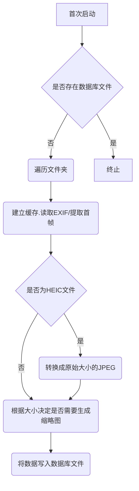
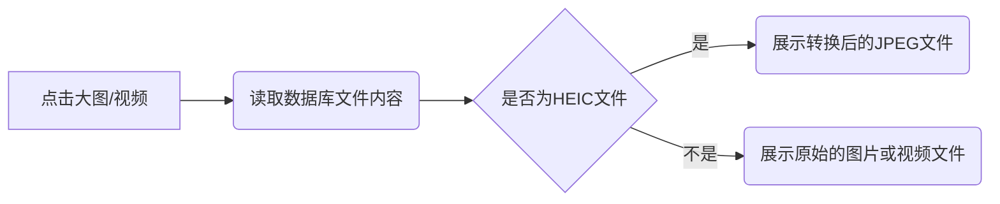

## 项目介绍

### 项目概述

本项目旨在开发一个基于 Python 的后端服务，用于处理和浏览已有成型的文件夹结构中的图片和视频。项目采用前后端分离的架构，后端负责多媒体文件的处理、存储和提供相关数据接口。该服务特别针对通过文件夹结构组织的多媒体内容，方便用户通过目录层级进行管理和浏览。

### 技术栈

- **编程语言**: Python
- **数据库**: SQLite
- **多媒体处理库**: Pillow, pyheif（用于 HEIC 文件转换）
- **Web 框架**: FastAPI（推荐）
- **其他工具**: SQLAlchemy（数据库交互）、ExifRead（读取 EXIF 信息）

### 支持的多媒体格式

后端服务支持以下主流图片和视频格式（扩展名不区分大小写）：

- **图片**: `.jpg`, `.jpeg`, `.png`, `.gif`, `.webp`, `.heic`, `.heif`
- **视频**: `.mp4`

对于 GIF 和 MP4 文件，将提取其第一帧作为预览图。

### 功能列表

1. **文件目录结构读取**
    - 遍历指定的媒体文件夹，读取其目录结构和多媒体文件。

2. **数据库交互**
    - 使用 SQLite 数据库存储文件信息，包括文件路径、EXIF 数据（图片）、缩略图路径等。

3. **缩略图生成**
    - 根据图片大小和配置生成缩略图，以优化前端展示性能。
    - **新增**: 对于 GIF 和 MP4 文件，提取第一帧作为缩略图。

4. **EXIF 信息读取**
    - 读取并存储图片的 EXIF 元数据，供前端展示使用。

5. **HEIC 文件处理**
    - 支持 HEIC 和 HEIF 格式的图片，自动转换为 JPEG 格式以便展示。

6. **视频预览图生成**
    - **新增**: 对于 MP4 和 GIF 文件，提取第一帧作为预览图。

7. **缓存机制**
    - 建立缓存机制，减少重复计算和文件读取，提高性能。

### 基本流程

#### 首次启动流程

#### 打开文件夹流程

#### 打开大图/视频流程

### 数据库设计

#### 表结构

- **folders**
    - `id` (INTEGER, PRIMARY KEY)
    - `folder_path` (TEXT, UNIQUE)  # 相对路径
    - `name` (TEXT)  # 文件夹名称
    - `parent_id` (INTEGER, FOREIGN KEY, 默认值为 NULL，根目录的父文件夹 ID 为 NULL)  # 父文件夹ID
    - `created_at` (TIMESTAMP)
    - `updated_at` (TIMESTAMP)

- **images**
    - `id` (INTEGER, PRIMARY KEY)
    - `file_path` (TEXT, UNIQUE)
    - `folder_id` (INTEGER, FOREIGN KEY, nullable=False)  # 所属文件夹ID
    - `name` (TEXT)  # 文件名
    - `thumbnail_path` (TEXT, nullable=True)
    - `exif_data` (JSON, nullable=True)
    - `is_heic` (BOOLEAN, default=False)
    - `converted_path` (TEXT, nullable=True)
    - `image_type` (TEXT, nullable=False)  # original, converted, thumbnail
    - `parent_id` (INTEGER, ForeignKey('images.id'), nullable=True)  # 原图ID，用于关联转换图和缩略图。对于缩略图和转换后的 HEIC 图片，指向原始图片 ID。
    - `is_thumbnail` (BOOLEAN, default=False)  # 是否作为缩略图使用
    - `created_at` (TIMESTAMP)
    - `updated_at` (TIMESTAMP)

#### 文件夹结构说明

- 根目录的 `parent_id` 为 NULL。
- 所有文件夹通过 `parent_id` 形成树状结构。
- API 默认从根目录开始查询。

### API 设计

基于提供的 OpenAPI 文档，API 设计如下：

1. **获取文件夹列表**
    - **Endpoint**: `/api/folders`
    - **Method**: `GET`
    - **Description**: 返回所有文件夹的列表及其相关信息。

2. **获取指定文件夹的图片和视频**
    - **Endpoint**: `/api/folders/{folder_id}/images`
    - **Method**: `GET`
    - **Description**: 返回指定文件夹中所有图片和视频的缩略图（或视频首帧）及基本信息。
    - **Query 参数**:
        - `page`: (可选) 页码，用于分页展示。

3. **获取大图或视频**
    - **Endpoint**: `/api/images/{image_id}`
    - **Method**: `GET`
    - **Description**: 根据图片或视频 ID 返回其详细信息。

4. **触发全盘扫描**
    - **Endpoint**: `/api/scan`
    - **Method**: `POST`
    - **Description**: 手动触发后台更新数据库的操作，用于全盘重新扫描。

5. **根路径**
    - **Endpoint**: `/api/`
    - **Method**: `GET`
    - **Description**: 根路径，可能用于健康检查或其他用途。

6. **获取完整图片或视频**
    - **Endpoint**: `/api/images/{image_id}/full`
    - **Method**: `GET`
    - **Description**: 根据图片或视频 ID 返回原始文件或转换后的 JPEG 文件（针对 HEIC）。

7. **获取子文件夹列表**
    - **Endpoint**: `/api/folders/{parent_id}/subfolders`
    - **Method**: `GET`
    - **Description**: 获取指定父文件夹下的所有子文件夹。
    - **Path 参数**:
        - `parent_id`: 父文件夹 ID，可以为 NULL 以获取根目录下的文件夹。

### 前端需求

- **框架**: 配合后端使用，采用 Tailwind CSS。
- **设计要求**:
    - 简洁易用
    - 响应式设计，便于移动端使用
    - 支持中英文切换
- **功能集成**:
    - 展示文件夹列表
    - 显示图片缩略图和视频预览图
    - 支持点击缩略图查看大图或播放视频

### 错误处理

- **404 Not Found**: 图片、视频或文件夹不存在。
- **500 Internal Server Error**: 服务器内部错误，如数据库连接失败、文件读取错误、媒体处理错误等。
- **400 Bad Request**: 请求参数错误。
- **422 Unprocessable Entity**:  请求数据验证失败。

### 性能优化

- **异步处理**: 使用异步 IO 处理文件读取和多媒体处理任务，提升响应速度。
- **批量操作**: 批量读取和写入数据库，减少数据库交互次数。
- **缓存机制**: 利用内存缓存或文件缓存，加快重复请求的响应速度。
- **缩略图优化**: 合理设置缩略图尺寸，减少存储空间和网络传输。

### 安全考虑

- **输入验证**: 对所有 API 输入进行严格验证，防止注入攻击。
- **权限控制**: 不需要用户认证和权限管理，因为是私有项目。
- **数据备份**: 定期备份 SQLite 数据库，防止数据丢失。

### 部署方案

- **服务器要求**: 支持 Python 运行环境，推荐使用 Linux 服务器。
- **依赖管理**: 使用 `requirements.txt` 管理 Python 依赖包。
- **容器化**: 最终通过 Docker 容器进行部署（详细方案待后续讨论）。
- **监控和日志**: 集成日志记录和监控工具，实时监控服务运行状态。

### 多语言支持

- **支持语言**: 中文和英文。
- **实现方式**: 后端提供多语言接口，前端根据用户选择切换语言。

### 缩略图生成策略

- **尺寸**: 固定大小（例如 200x200 像素）。
- **比例**: 保持原图/视频的宽高比例，避免变形。
- **视频**: 提取视频文件的第一帧作为缩略图。

### 多媒体文件更新机制

- **全盘重新扫描**:
    - **触发方式**: 手动触发通过 `/api/scan` 或首次启动时自动触发。
    - **流程**: 遍历所有文件夹和多媒体文件，更新数据库和缓存。
- **实时文件夹监控**:
    - **工具**: 使用 `watchdog` 库实现文件夹的实时监控。
    - **功能**: 监控文件夹内的新增、删除、修改事件，实时更新数据库和缓存。

### 待确认事项

目前所有待确认事项已根据用户提供的信息进行了确认和更新。

### 未来扩展（可选）

虽然当前项目需求已明确，但未来可以考虑以下扩展功能：

- **用户认证与权限管理**: 若项目公开或需要多用户访问时。
- **更多语言支持**: 支持其他语言以适应更广泛的用户群体。
- **高级搜索与过滤**: 根据 EXIF 数据、文件名、创建时间等进行搜索。
- **图像/视频编辑功能**: 提供基本的图像编辑和批量处理工具，以及简单的视频信息展示。
- **在线视频播放**:  集成视频播放器，支持直接在前端播放视频。